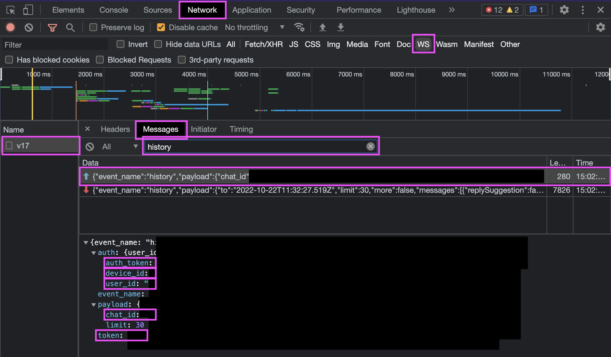

= Replika Chat Export
ifdef::env-github[]
:tip-caption: :bulb:
:note-caption: :information_source:
:important-caption: :heavy_exclamation_mark:
:caution-caption: :fire:
:warning-caption: :warning:
endif::[]

So you want to export your chat messages with your https://replika.com[replika]?

CAUTION: Looking for a no-code, one-click, zero-setup export? Check out the https://index.garden/replika-export/[browser extension].

Here is how to do it:

. Clone the repo and open it in VS Code:
+
[source,console]
----
git clone https://github.com/devidw/replika-chat-export
code replika-chat-export
----
. Make sure you have the
https://marketplace.visualstudio.com/items?itemName=ms-vscode-remote.remote-containers[Dev
Container's extension] installed and open the folder as container
. The export script will open a web socket connection to ws.replika.com. To
authenticate yourself, you need to provide your auth details. Set the needed env
variables and the script will include them when fetching your messages. You can
set them in a `.env` file:
+
[source,console]
----
REPLIKA_CHAT_ID=XXXXXXXXXXXXXXXXXXXXXXXX
REPLIKA_USER_ID=XXXXXXXXXXXXXXXXXXXXXXXX
REPLIKA_AUTH_TOKEN=XXXXXXXX-XXXX-XXXX-XXXX-XXXXXXXXXXXX
REPLIKA_DEVICE_ID=XXXXXXXX-XXXX-XXXX-XXXX-XXXXXXXXXXXX
----
// REPLIKA_TOKEN=XXXXXXXX-XXXX-XXXX-XXXX-XXXXXXXXXXXX
+
To get your values, open the dev tools on https://my.replika.com and follow the
details on the screenshot:
+

+
. Once you have all required env variables set, you can execute the export
script:
+
[source,console]
----
pnpm run dev
----
. This will call `main.js` and queries your messages in chunks of 100 messages,
once there are no more messages to fetch, all your messages will be written into
`messages.json` on your local file system

== Performance

You should be able to export around 300 messags per second.
